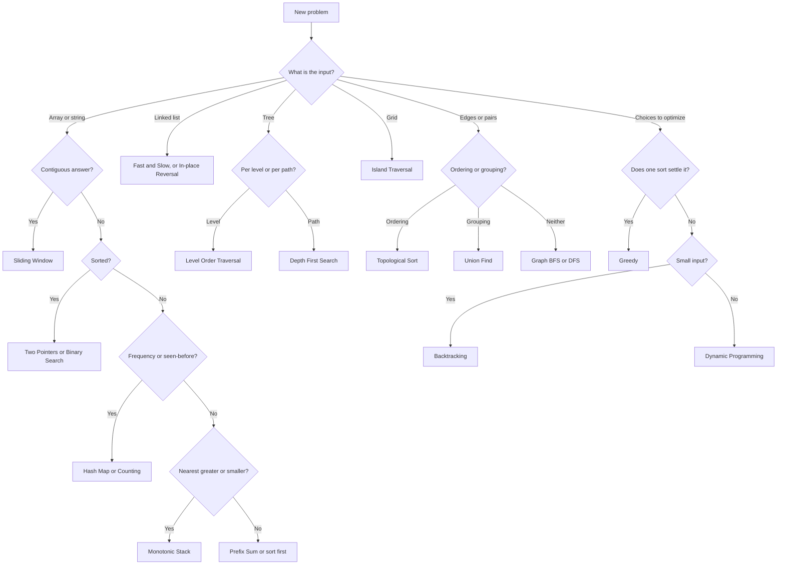

# How to Recognize the Pattern in Sixty Seconds

You have read a problem you have never seen. You have about a minute before the silence gets uncomfortable. This page is how you spend it.

Work in this order: read the constraints, name the input shape, match the question wording, then say the pattern out loud before you write anything.

## Step 1: read the constraints first

The size of the input tells you the complexity you are allowed, and the complexity narrows the pattern to a handful of candidates. This is the fastest signal in any problem statement, and most candidates skip it.

| If n is up to | You can afford | Which usually means |
|---|---|---|
| 10 to 12 | O(n!) | Permutations, [backtracking](../patterns/backtracking.md) |
| 15 to 25 | O(2^n) | [Subsets](../patterns/subsets.md), bitmask over subsets |
| 30 to 45 | O(2^(n/2)) | [Meet in the middle](../patterns/meet-in-the-middle.md) |
| 100 to 500 | O(n³) | Interval or range [dynamic programming](../patterns/palindromic-subsequence.md) |
| 5,000 | O(n²) | Two-dimensional dynamic programming, pairwise scans |
| 10^5 to 10^6 | O(n log n) | Sorting, heaps, [binary search](../patterns/modified-binary-search.md), [segment tree](../patterns/segment-tree.md) |
| 10^7 to 10^8 | O(n) | [Sliding window](../patterns/sliding-window.md), [two pointers](../patterns/two-pointers.md), [prefix sum](../patterns/prefix-sum.md), [monotonic stack](../patterns/monotonic-stack.md) |
| 10^9 and above | O(log n) or O(1) | Binary search on the answer, math |

Two more constraint tells:

- "Solve it in O(1) extra space" rules out hash maps and visited sets. Look at [two pointers](../patterns/two-pointers.md), [fast and slow pointers](../patterns/fast-and-slow-pointers.md), [cyclic sort](../patterns/cyclic-sort.md), and [bitwise XOR](../patterns/bitwise-xor.md).
- A stated value range, like "values are between 1 and n" or "lowercase English letters", points at [cyclic sort](../patterns/cyclic-sort.md), [counting](../patterns/counting.md), or [linear sorting](../patterns/linear-sorting-algorithms.md).

## Step 2: name the input shape

| The input is | Start looking at |
|---|---|
| A sorted array | [Two Pointers](../patterns/two-pointers.md), [Modified Binary Search](../patterns/modified-binary-search.md) |
| An unsorted array | [Hash Maps](../patterns/hash-maps.md), [Counting](../patterns/counting.md), sort it first |
| An array of intervals | [Merge Intervals](../patterns/merge-intervals.md) |
| A string | [Sliding Window](../patterns/sliding-window.md), [Counting](../patterns/counting.md), [Trie](../patterns/trie.md) |
| A linked list | [Fast and Slow Pointers](../patterns/fast-and-slow-pointers.md), [In-place Reversal](../patterns/in-place-reversal-of-a-linked-list.md) |
| A tree | [Level Order](../patterns/tree-level-order-traversal.md) for levels, [DFS](../patterns/tree-depth-first-search.md) for paths |
| A 2D grid | [Island](../patterns/island-matrix-traversal.md), or [Simulation](../patterns/simulation.md) if it describes a process |
| Edges or pairs | [Graphs](../patterns/graphs.md), [Topological Sort](../patterns/topological-sort.md), [Union Find](../patterns/union-find.md) |
| Several sorted lists | [K-way Merge](../patterns/k-way-merge.md) |
| A stream of numbers | [Two Heaps](../patterns/two-heaps.md), [Top K Elements](../patterns/top-k-elements.md) |
| Items with a weight and a value | [0/1 Knapsack](../patterns/0-1-knapsack.md) |

## Step 3: match the question wording

Ask these in order and stop at the first yes.

1. **Is the input sorted, or can it be?** [Two Pointers](../patterns/two-pointers.md), [Modified Binary Search](../patterns/modified-binary-search.md), or [Merge Intervals](../patterns/merge-intervals.md).
2. **Is the answer a contiguous subarray or substring?** [Sliding Window](../patterns/sliding-window.md), or [Monotonic Queue](../patterns/monotonic-queue.md) if it also needs a maximum.
3. **Many range sums over an array that never changes?** [Prefix Sum](../patterns/prefix-sum.md).
4. **A linked list, asking about cycles, the middle, or reversal?** [Fast and Slow Pointers](../patterns/fast-and-slow-pointers.md) or [In-place Reversal](../patterns/in-place-reversal-of-a-linked-list.md).
5. **A tree, answered per level or by shortest depth?** [Tree Level Order Traversal](../patterns/tree-level-order-traversal.md).
6. **A tree, answered per path?** [Tree Depth First Search](../patterns/tree-depth-first-search.md).
7. **A 2D grid with connected cells?** [Island (Matrix Traversal)](../patterns/island-matrix-traversal.md).
8. **Nodes and edges, asking about routes or reachability?** [Graphs](../patterns/graphs.md).
9. **Matching, nesting, or the most recent unfinished item?** [Stacks](../patterns/stacks.md).
10. **Next greater or smaller element?** [Monotonic Stack](../patterns/monotonic-stack.md).
11. **Seen before, or grouping by a computed key?** [Hash Maps](../patterns/hash-maps.md).
12. **How often does each value appear?** [Counting](../patterns/counting.md).
13. **Top K, Kth, or the median?** [Top K Elements](../patterns/top-k-elements.md) or [Two Heaps](../patterns/two-heaps.md).
14. **The nearest value above or below, in a set that keeps changing?** [Ordered Set](../patterns/ordered-set.md).
15. **All combinations or permutations?** [Subsets](../patterns/subsets.md) or [Backtracking](../patterns/backtracking.md).
16. **Prefixes, autocomplete, or a dictionary searched often?** [Trie](../patterns/trie.md).
17. **Optimization under a capacity or a budget?** [0/1 Knapsack](../patterns/0-1-knapsack.md).
18. **Counting the ways to reach step n?** [Fibonacci Numbers](../patterns/fibonacci-numbers.md).
19. **Palindromes, or two strings compared?** [Palindromic Subsequence](../patterns/palindromic-subsequence.md).
20. **The best arrangement, where one sort settles every choice?** [Greedy Algorithms](../patterns/greedy-algorithms.md).
21. **Dependencies or a valid order?** [Topological Sort](../patterns/topological-sort.md).
22. **Connectivity or grouping, with connections added over time?** [Union Find](../patterns/union-find.md).
23. **Several sorted streams?** [K-way Merge](../patterns/k-way-merge.md).
24. **Range queries where the values also change?** [Segment Tree](../patterns/segment-tree.md) or [Binary Indexed Tree](../patterns/binary-indexed-tree.md).
25. **Many range queries for something that cannot be subtracted, all known up front?** [Mo's Algorithm](../patterns/mos-algorithm.md).
26. **None of the above, and the input is small?** [Backtracking](../patterns/backtracking.md), [Simulation](../patterns/simulation.md), or [Meet in the Middle](../patterns/meet-in-the-middle.md).

The specialist patterns answer narrower questions: [Cyclic Sort](../patterns/cyclic-sort.md) for a dense range of values, [Bitwise XOR](../patterns/bitwise-xor.md) for a single unpaired number, [Linear Sorting](../patterns/linear-sorting-algorithms.md) when the value range is small, [Serialize and Deserialize](../patterns/serialize-and-deserialize.md) and [Clone](../patterns/clone.md) for reproducing a structure, [Articulation Points](../patterns/articulation-points-and-bridges.md) for single points of failure, and [Multi-threaded](../patterns/multi-threaded.md) when the interviewer asks for concurrency.

## The decision tree

## Patterns that get confused with each other

| These two | Tell them apart by |
|---|---|
| Sliding Window and Prefix Sum | A window needs all-positive values and finds one best subarray. Prefix sums handle negatives and count many subarrays. |
| Greedy and Dynamic Programming | If an early choice can block a better later one, greedy is wrong. Try to build that counterexample before you commit. |
| Backtracking and Dynamic Programming | Backtracking lists every answer. Dynamic programming counts them or scores the best one. If you only need a number, cache and stop enumerating. |
| Two Pointers and Hash Map | Sorted input, or an O(1) space requirement, means two pointers. Unsorted input with no space limit means a hash map. |
| Monotonic Stack and Monotonic Queue | A stack answers next greater or smaller for each element. A queue answers the extreme inside a moving window. |
| BFS and DFS on a graph | Fewest steps means BFS. Reachability, path building, or cycle detection means DFS. |
| Segment Tree and Binary Indexed Tree | Both handle updates. A binary indexed tree is shorter but only for reversible operations like sum. Minimum and maximum need a segment tree. |
| Union Find and Graph traversal | If edges arrive over time and you must answer as they arrive, union find. If the graph is fixed, one traversal is simpler. |
| Subsets and Backtracking | Same tree. Use the iterative subsets build when you want everything. Use backtracking when a rule lets you prune branches early. |

## If nothing matches

Go back to the constraints. They are the strongest hint in the problem, and they are almost never decoration. A limit of n equal to 20 with a "find all" question is an enumeration problem no matter how it is worded. A limit of 10^9 with a "find the minimum X that works" question is a binary search on the answer, whatever the story around it.

Then say what you have out loud: "the brute force here is O(n²) because of the nested loop, and the constraint says n is 10^5, so I need something closer to linear." Interviewers give credit for that sentence on its own, and saying it often makes the pattern obvious.

## Go deeper

- All 41 patterns, one page each: [patterns/](../patterns/)
- The full course, with worked solutions in six languages: [Grokking the Coding Interview](https://www.designgurus.io/course/grokking-the-coding-interview)
